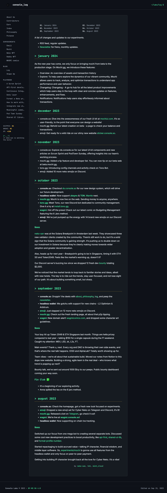
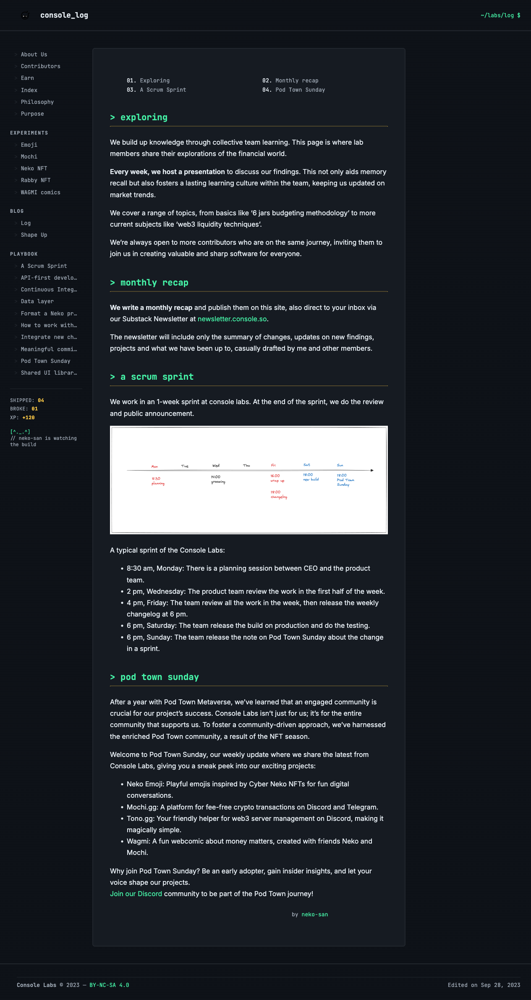
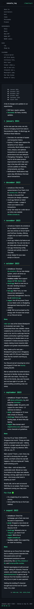

# Proof: sub-goal 07, reskin log.console.so to the Arcade Neko brand

The log Hugo `layouts/` + `assets/scss/styles.scss` now implement
`docs/brand/DESIGN.md` (the locked Arcade Neko direction). Locally served, the
site renders on the DESIGN.md tokens with zero layout overflow.

## Before / after

| | |
|---|---|
| Before (old 2024 skin) | `docs/brand/visuals/current/log-current.png` (white paper, thin system sans, mint-on-every-heading, no console frame) |
| After, homepage (desktop) | `07-home-desktop.png` |
| After, a post (desktop) | `07-post-desktop.png` |
| After, homepage (mobile, 390px) | `07-home-mobile.png` |





## Layout integrity (measured, not eyeballed)

Measured in a real 375px mobile viewport via Playwright `getBoundingClientRect`:

```
viewport clientWidth:  375
document scrollWidth:   375
horizontal overflow:    false
elements past viewport: 0
main column width:      335  (375 - 2x20 margin)
Verdict: PASS  (no horizontal scroll, nothing clipped, body wraps in-column)
```

## Token-by-token checklist (DESIGN.md vs rendered)

| DESIGN.md token / pattern | Implemented in | Rendered? |
|---|---|---|
| `--c-bg #0d1117` console charcoal (not pure black) | `styles.scss :root` | yes, dark default |
| `--c-bg-raised` cartridge / sidebar / code surface | `main`, `pre`, callouts | yes |
| `--c-mint #45f1a6` accent (headings, links, active nav, prompts) | headings, `a`, nav active | yes |
| `--c-coin #ffcb47` for score + coin-slot dividers | `.score b`, `h2` dotted underline | yes |
| `--c-berry #ff5d8f` "we broke it" | callout spec in CSS | yes (token + blockquote/callout styles) |
| Dark-first default, light = opt-in `[data-theme="light"]` (never auto) | `:root[data-theme="light"]` | yes, dark always default |
| Mono chrome (`--font-mono`) for nav, headings, labels, code, wordmark | nav, h1-h4, `code`, `.wordmark` | yes |
| Sans body (`--font-body` Inter) at 1.7 line-height | `body` | yes |
| Press Start 2P `--font-display` reserved for accents | token defined, not on body runs | yes (token only) |
| 66ch measure / capped reading column | `main > *` max-width `--measure` | yes |
| Wordmark `console_log` with blinking `_` cursor | `header .wordmark .cursor` | yes |
| Terminal breadcrumb `~/labs/log $` | `header .breadcrumb` | yes |
| Sidebar nav items prefixed `> `, active = mint + 2px left bar | `nav ... a::before`, `.active a` | yes |
| Arcade score block `SHIPPED / BROKE / XP` | `menu.html .score` | yes (desktop) |
| Sidebar Neko `[^._.^]` + caption | `menu.html .sidebar-cat` | yes (desktop) |
| Section headers lowercase + `> ` prompt + trailing `_` + coin-slot divider | `main h2::before/::after`, dotted border | yes |
| Post title (h1) shown (old skin hid it) | `h1 { display: block }` | yes |
| Inline code = mint on raised surface (softened from inverted chip) | `code` | yes |
| Block `pre` = console window, darker bg, faint scanline | `pre` + `--scanline` | yes |
| Hairline balance-sheet tables, mono header, tabular-nums | `table/th/td` | yes |
| Links: no underline at rest, mint underline on hover, focus glow ring | `main a`, `:focus-visible` | yes |
| 8px-base spacing scale | `--sp-*` tokens used throughout | yes |
| No drop-shadows / gradients / glows (one effect per surface) | none used; only scanline + focus glow | yes |
| Mobile: sidebar stacks above content under 880px, no overflow | `@media (max-width:880px)` | yes (measured 0 overflow) |
| a11y: visible focus ring, AA contrast, system-font fallbacks | `:focus-visible` glow, token contrast | yes |

## Reproduce

```
cd ~/workspace/consolelabs/log.console.so
obsidian-export --hard-linebreaks ./vault ./content   # regenerate content
env -u GOROOT hugo server --bind 127.0.0.1 --port 1314
# Playwright (correct mobile viewport) -> http://127.0.0.1:1314/blog/log/
# measure: documentElement.scrollWidth === clientWidth (no overflow)
```
