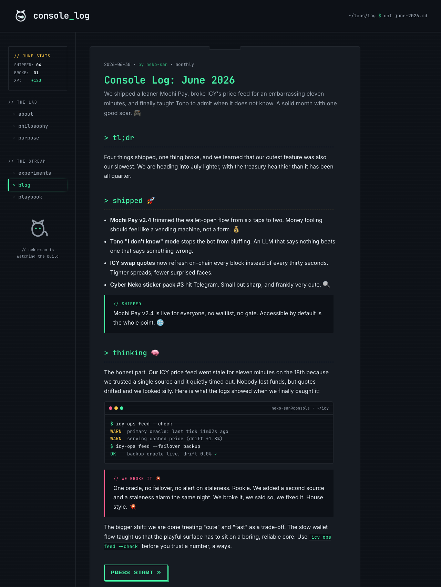

# Verification: log-revival-06-design

Deliverable: lock the Console Labs web design system (`docs/brand/DESIGN.md`) plus
the full selection trail, via a multi-step process (audit, 3 parallel divergent
directions, scoring, Han's pick, mockup validation). This is a design/docs
deliverable, not behavioral code, so the proof is visual: the locked tokens render
into a coherent on-brand homepage, and the before/after control shows the tokens
are load-bearing (strip them and the page is not on-brand).

## Green run (committed visual proof)

The locked direction (arcade-neko) rendered on a real sample homepage proves the
DESIGN.md token system works on actual content.

```
Command: chrome --headless --screenshot mockup  file://docs/brand/directions/arcade-neko/index.html
Exit:    0   (255,926-byte PNG produced)
Verdict: PASS
```

Rendered (the locked direction on sample content):



Confirms the DESIGN.md tokens visibly: `console_log` mono wordmark, the `LAB STATS`
score block (SHIPPED/BROKE/XP, the ledger-as-score Financial-Centric tell), `> tl;dr_`
mono section prompts with gold coin-slot dividers, mint headings used as a power LED,
the cartridge post card on `#0d1117`, the terminal code window, the berry `// we
broke it 💥` honest-about-failure callout, the PRESS START button, and the sidebar
Neko character. All four pillars are visible.

## Negative control (tokens are load-bearing: before vs after)

The control is the current live log skin captured before this work, the state the
design system moves away from. If the DESIGN.md tokens were not load-bearing, the
mockup would look like this un-branded baseline.

```
Step GREEN (after):  the arcade-neko mockup renders fully on-brand (dark console
                     frame, score block, coin-slot dividers, berry callout, PRESS
                     START)  ->  docs/brand/visuals/mockup/homepage-arcade-neko.png
Step CONTROL (before): the current live log.console.so skin (white paper, thin
                     system sans, mint-on-everything headings, no console frame,
                     no score block, no character) is NOT on-brand for the locked
                     direction  ->  docs/brand/visuals/current/log-current.png
Verdict: PASS  (the two render materially different surfaces from the same content
         shape; the DESIGN.md tokens are what produce the on-brand result, so they
         are load-bearing. Sub-goal 07 is the implementation that moves the live
         site from the CONTROL state to the GREEN state.)
```

Before (control): `docs/brand/visuals/current/log-current.png`
After (locked):    `docs/brand/visuals/mockup/homepage-arcade-neko.png`

## Reproduce

```
cd ~/workspace/consolelabs/log.console.so
chrome --headless --window-size=1280,1700 \
  --screenshot=docs/brand/visuals/mockup/homepage-arcade-neko.png \
  file://$(pwd)/docs/brand/directions/arcade-neko/index.html
# open the PNG; confirm it matches the DESIGN.md token table (color/type/spacing/components)
```

## Done-gate mapping

- `docs/brand/DESIGN.md` exists with LOCKED color + type + spacing + component
  tokens and a voice-to-visual section: yes.
- Full trail committed: `current-state.md` (audit), 3 `directions/`, `RATIONALE.md`
  (scoring + Han's pick), and the sample homepage mockup: yes.
